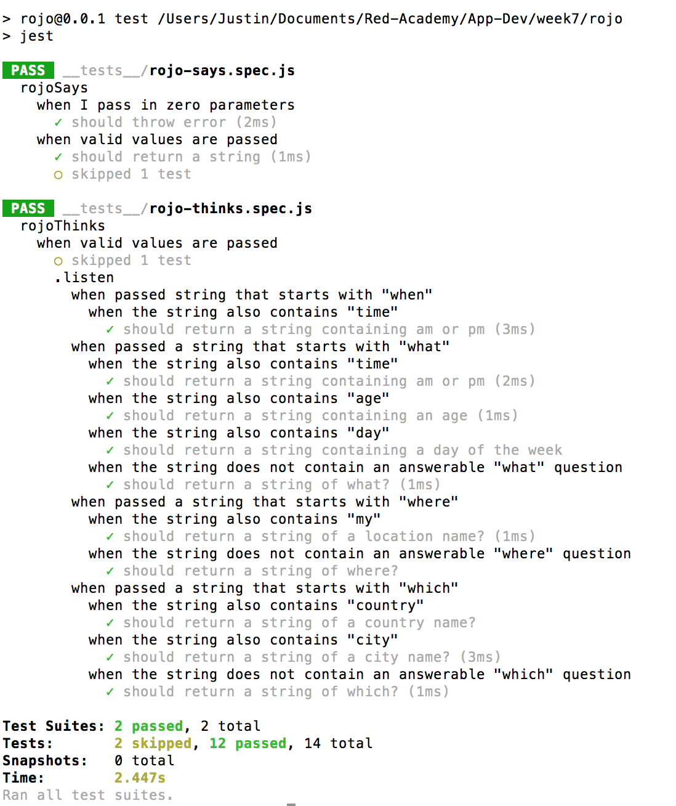

# Behaviour and test-driven development with Jest - JavaScript, Jest

The purpose of this project was to explore the principles of behaviour and test-driven development using Jest. To explore these concepts 
the goal of building a JavaScript application that could accept a question parameter and return and answer was considered.

The first thing implemented to build the app was a series of behaviour-driven development stories and narratives.  These were then 
transformed into a series of Jest tests of anticipated results for the application.  The application was then built according to the 
desired results and fine-tuned to deliver the required functionality.

## Technologies Used

- JavaScript
- Jest

## Personal Learnings

The reverse paradigm of building an application's tests first was the biggest leaning I gained from this project, first by considering 
the behaviour and then transforming this behaviour into testable units. I also learned how to implement and use Jest to create the tests.

## To Do

I would like to expand the scope of this project to different types of test and expand the functionality of the application.